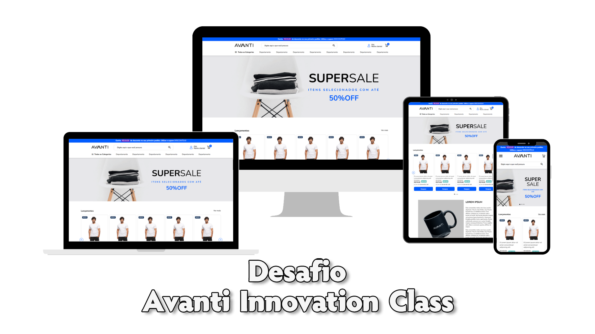

<div align="center">



</div>

</br>

</br>

# Sobre o projeto

### Descrição

Esse projeto consistiu na resolução de um um desafio técnico da <a href="https://ic.penseavanti.com.br/">Avanti Inovattion Class</a>, onde é proposto a criação de um site de e-commerce dinâmico e responsivo a partir de um layout no Figma. 

Visando uma maior fixação dos recursos aprendidos durante este projeto, não foram utilizados quaisquer ferramentas para a criação de componentes do site, destacando-se os elementos *carrossel*, *slider* e *menu hamburguer*, que tiveram suas estruturas e lógicas criadas totalmente do zero utilizando apenas *HTML*, *CSS* e *JavaScript*. Além disso, pelo mesmo motivo, também não foram utilizadas bilbiotecas de *front-end* para a auxiliar na criação da responsividade do site.


### Linguagens utilizadas


### Ferramentas utilizadas


</br>

</br>

# Instalação

O projeto não possui *frameworks*, tornando-o bem simples para instalação, sendo necessário apenas ter o *git* instalado em sua máquina.

Inicialmente, abra o terminal de sua IDE ou do próprio sistema operacional e , caso necessário, altere o diretório para o local onde você deseja instalar o repositório.

```
cd "diretorio-desejado"
```

Após isso, insira o comando para clonar o repositório para sua máquina local.

```
git clone https://github.com/lucas-lob/challenge-avanti-class.git
```

</br>

</br>

# Principais recursos desenvolvidos

### Carrossel

**Descrição:** Carrossel responsível desenvolvido inteiramente do zero, sem auxílio de bibliotecas/*frameworks*. Ele conta com uma estrutura flexível, onde os *cards* são inseridos automaticamente a partir de um objeto *JavaScript* que simula um arquivo *json*.

**Conceitos aprendidos:** Com esse recurso, pude aprender detalhes aprofundados sobre posicionamentos de elementos, *scrolls* e temporizadores. Além disso, uma vez que ele foi feito sem utilização de bibliotecas/*frameworks*, seu desenvolvimento aumentou consideravelmente minhas habilidades de racíocínio lógico e capacidade de resolução de problemas.


</br>

### Menu hamburguer

**Descrição:** Menu hamburguer responsivo com duas partes distintas. Sua estrutura foi desenvolvida visando flexibilidade, sendo possível, facilmente, inserir as informações dos items a partir de um arquivo *json*.

**Conceitos aprendidos:** Com esse elemento, pude aperfeiçoar minhas habilidades sobre estruturas em *HTML* e estilização de seu posicionamento com *CSS*.


</br>

### Barra de pesquisa

**Descrição:** barra de pesquisa simples utilizando JavaScript.

**Conceitos aprendidos:** Com esse recurso, pude fixar conceitos alusivos à utilização de JavaScript para adicionar funções dinâmicas na aplicação *Web*.


</br>

</br>

# Contatos

Contate-me através dos *links* abaixo!

<a href="https://www.linkedin.com/in/lucas-lobato-chagas-036159201/"></a>

E-mail: lucas.mcp23@gmail.com

